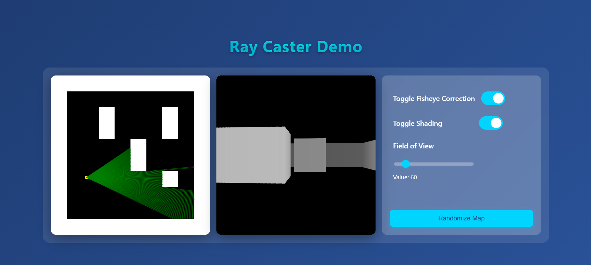

# Simple Ray Caster

## Summary

A simple ray casting engine implemented in JavaScript using HTML5 Canvas. This project demonstrates the ray casting technique used in classic 3D games like Wolfenstein 3D. The application renders a 2D top-down map view and a 3D first-person perspective using ray casting algorithms.

Users can navigate through the 3D environment using WASD keys or Arrow keys, with interactive controls for adjusting field of view, toggling fisheye correction, and applying shading effects.

## Tech Stack

- **Frontend Framework:** HTML5, CSS3, JavaScript (ES6)
- **Libraries:** jQuery 3.7.1
- **Rendering:** HTML5 Canvas 2D Context
- **Styling:** Modern CSS with Flexbox, Gradients, and Glassmorphism effects
- **Version Control:** Git & GitHub

## Ray Casting Method

Ray casting is a rendering technique that simulates 3D graphics by casting rays from the player's viewpoint and determining where those rays intersect with walls in the environment.

### How it Works:

1. **Ray Generation:** For each vertical line of the screen, a ray is cast from the player's position at a specific angle relative to the player's viewing direction.

2. **Wall Detection:** Each ray travels through the 2D world until it hits a wall. The algorithm calculates the distance from the player to the wall.

3. **Wall Rendering:** The distance determines the height of the wall drawn on screen - closer walls appear taller, creating the illusion of depth.

4. **Shading:** Optional shading can be applied based on distance or wall direction to enhance the 3D appearance.

5. **Field of View (FOV):** The FOV determines the width of the viewing angle, allowing players to adjust how wide their perspective is.

### Features Implemented:

- **Fisheye Correction:** Corrects the barrel distortion that occurs in basic ray casting
- **Distance-based Shading:** Walls appear darker when farther away, enhancing depth perception
- **Interactive Controls:** Adjust FOV in real-time, toggle visual effects
- **Responsive Map:** Dynamically generate random maps to explore different environments

## Screenshot



## Controls

### Movement
- **W / ↑** - Move forward
- **S / ↓** - Move backward
- **A / ←** - Turn left
- **D / →** - Turn right

### Interactive Features
- **Toggle Fisheye Correction** - Enable/disable barrel distortion correction
- **Toggle Shading** - Enable/disable distance-based wall shading
- **Field of View Slider** - Adjust the viewing angle (45° to 180°)
- **Randomize Map** - Generate a new random world to explore

## Installation & Usage

1. Clone the repository:
   ```bash
   git clone https://github.com/ashwanikd0123/Ray-Caster.git
   cd Ray-Caster
   ```

2. Open `index.html` in a web browser to start the ray caster

3. Use the controls to navigate through the 3D environment and experiment with different settings

## Project Structure

```
Ray-Caster/
├── index.html          # Main HTML file with canvas and controls
├── main.js             # Ray casting engine and game logic
├── style.css           # Styling with responsive design
├── images/             # Project images and screenshots
└── README.md           # Project documentation
```

## Browser Compatibility

- Chrome/Chromium (Latest)
- Firefox (Latest)
- Safari (Latest)
- Edge (Latest)

## Author

Created by [ashwanikd0123](https://github.com/ashwanikd0123)
